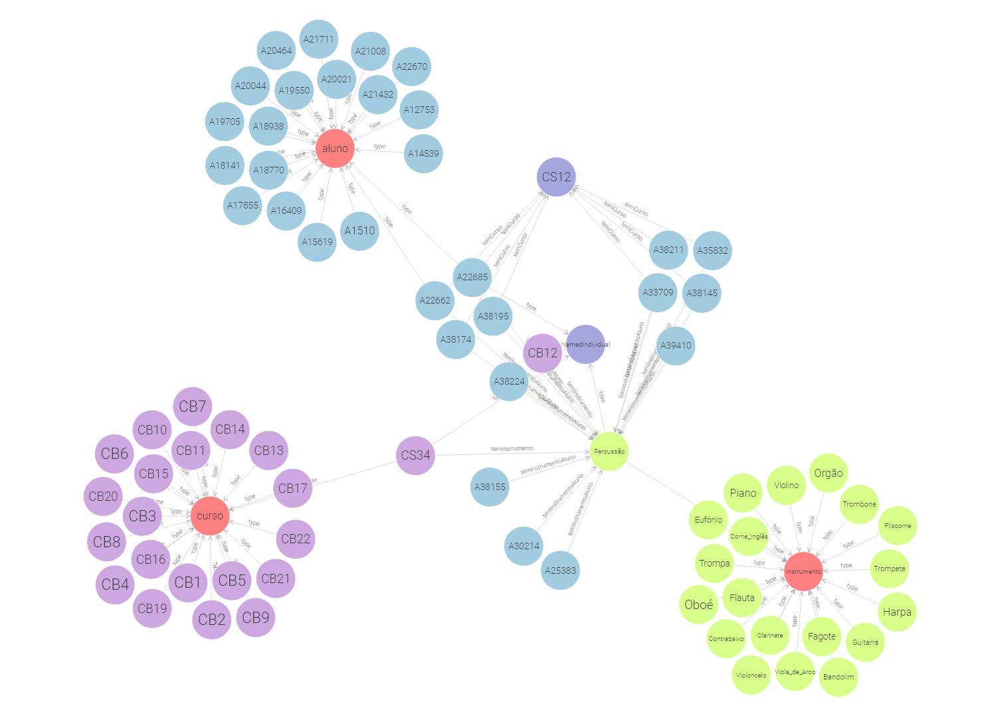

## Abordagem 
À semelhança do TPC da semana passada este trabalho consiste outra vez nos seguintes passos:
* Analisar Dataset
* Criar uma ontologia: classes, object properties e data properties
* Criar um script para povoar a ontologia
* Criar um repositório no graphDB com ontologia

## Autor
André Freitas (PG54707)

## Ficheiros 
#### Dataset 
[dataset.json](dataset.json)

#### Ficheiro TTL gerado para uma instância 
[fase1.ttl](fase1.ttl)

#### Código Python usado para gerar o resto das entradas 
[geraTTL.py](geraTTL.py)

## Resultados 
#### TTL final 
[fase2.ttl](fase2.ttl)

#### Diagrama gerado no graphDB 

