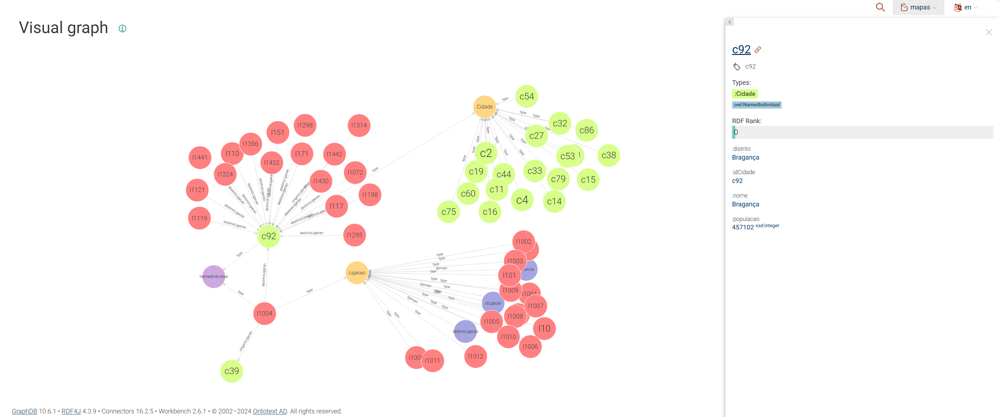

## Abordagem 
* Analisar Dataset
* Criar uma ontologia: classes, object properties e data properties
* Criar um script para povoar a ontologia
* Criar um repositório no graphDB com ontologia
* Adquirir uma representação gráfica da ontologia
* Responder às perguntas com queries de SPARQL

## Autor
André Freitas (PG54707)

## Ficheiros 
#### Dataset  
[mapa.json](mapa.json)

#### Ficheiro TTL gerado para a primeira instância
[fase1.ttl](fase1.ttl)

#### Código Python usado para gerar o resto das entradas 
[geraTTL.py](geraTTL.py)

## Resultados 
#### TTL final 
[fase2.ttl](fase2.ttl)

#### Diagrama gerado no graphDB 

## Respostas às perguntas
#### 1 - Quais as cidades de um determinado distrito?
PREFIX : <http://rpcw.di.uminho.pt/2024/mapa/>

SELECT ?cidades WERE {
&emsp;?cidade :distrito "Braga" . 
&emsp;?cidade :nome ?cidades .
} 

#### 2 - Distribuição de cidades por distrito?
PREFIX : <http://rpcw.di.uminho.pt/2024/mapa/>

SELECT ?distrito (COUNT(DISTINCT ?cidade) AS ?cidades) WHERE {
&emsp;?cidade :distrito ?distrito . 
} GROUP BY ?distrito
#### 3 - Quantas cidades se podem atingir a partir do Porto?
PREFIX : <http://rpcw.di.uminho.pt/2024/mapa/>

SELECT (COUNT(DISTINCT ?cidades) AS ?destinosPorto) WHERE {
&emsp;?porto :distrito "Porto" .
&emsp;?ligacao :origemLigacao ?porto . 
&emsp;?ligacao :destinoLigacao ?destino . 
&emsp;?destino :nome ?cidades .
}

#### 4 - Quais as cidades com população acima de um determinado valor?
PREFIX : <http://rpcw.di.uminho.pt/2024/mapa/>

SELECT ?cidades ?populacao WHERE {
&emsp;?cidade :populacao ?populacao filter (?populacao > 350000) .
&emsp;?cidade :nome ?cidades .
}